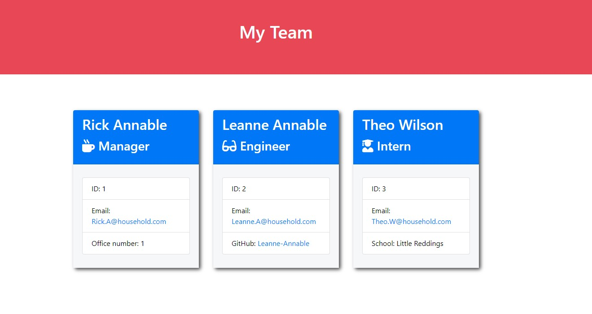

<!-- Improved compatibility of back to top link: See: https://github.com/othneildrew/Best-README-Template/pull/73 -->
<!--
*** Thanks for checking out the Best-README-Template. If you have a suggestion
*** that would make this better, please fork the repo and create a pull request
*** or simply open an issue with the tag "enhancement".
*** Don't forget to give the project a star!
*** Thanks again! Now go create something AMAZING! :D
-->

# Team-Profile-Generator
[](https://opensource.org/licenses/MIT)

  ## Table of Contents
<details>
  <summary>Table of Contents</summary>
  <ol>
    <li>
      <a href="#description">Description</a>
      <ul>
        <li><a href="#user-story">User Story</a></li>
        <li><a href="#project-requirements">Project Requirements</a></li>
        <li><a href="#built-with">Built With</a></li>
      </ul>
    </li>
    <li>
      <a href="#getting-started">Getting Started</a>
      <ul>
        <li><a href="#installation">Installation</a></li>
        <li><a href="#usage">Usage</a></li>
        <li><a href="#tests">Tests</a></li>
      </ul>
    </li>
    <li><a href="#license">License</a></li>
    <li><a href="#contact">Contact</a></li>
    <li><a href="#acknowledgements">Acknowledgements</a></li>
  </ol>
</details>
<br>
<br>

## Description

  A way to make a nicely displayed list of employees within a team with links to their relative informtion.
<br>
<br> 

## User Story

  AS an Employer <br>
  I WANT to create a well displayed webpage <br>
  SO THAT I can see a teams members and their basic contact information. <br>

<p align="right">(<a href="#table-of-contents">back to top</a>)</p>

## Project Requirements

For this project we needed to take the given starter code and turn it into a working Node.js command-line application.<br>
When run it takes all the unputted information about each staff member, and uses it to create a webpage that displays the basic contact information of each member as shown below.




<p align="right">(<a href="#table-of-contents">back to top</a>)</p>

## Built With

  <br>
  <br>
  

<p align="right">(<a href="#table-of-contents">back to top</a>)</p>

## Getting Started

To Install and use this application, please follow the next steps listed below.

<p align="right">(<a href="#table-of-contents">back to top</a>)</p>

## Installation

* Clone the Repo
```sh
git clone git@github.com:Leanne-Annable/Team-Profile-Generator.git
```

Once the repo has been cloned to your designated location, you will then need to access the command-line and run 'npm i inquirer@6.5.0' to install inquirer.<br>
You will then need to install jest for testing capabilities using the 'npm i jest'.

<p align="right">(<a href="#table-of-contents">back to top</a>)</p>

## Usage

Once the project has been installed, you will then need to run 'node index.js' in the command line.<br>
You will then be prompted to answer a selection of questions about your team members and their details.<br>
When the questions have all been answered for each of your members the page will be generated.<br>
All you need to do now is to open the html page in a browser and the information will be there for viewing as shown above.

<p align="right">(<a href="#table-of-contents">back to top</a>)</p>

## Tests

You can run tests on the project by inputting 'npm test' into the command line.

<p align="right">(<a href="#table-of-contents">back to top</a>)</p>

## License

This project is using the MIT license. See the LICENCE file for more information <br>
[](https://opensource.org/licenses/MIT)

<p align="right">(<a href="#table-of-contents">back to top</a>)</p>

## Contact

  - If you have any questions about the repo, please contact me on: 
  
  - email: <a href="mailto:l.annable@outlook.com">l.annable@outlook.com</a>

  - GitHub: <a href="https://github.com/Leanne-Annable" target="_blank" rel="noopener noreferrer">Leanne-Annable</a>

<p align="right">(<a href="#table-of-contents">back to top</a>)</p>

## Acknowledgements

I would like to thank my tutors for their guidance and multiple GitHub repo's with information about README badges, listed below.

* [Best-README-Template](https://github.com/othneildrew/Best-README-Template)<br>
* [README-Badges](https://github.com/alexandresanlim/Badges4-README.md-Profile/blob/master/README.md)<br>
* [Licence-Badges](https://gist.github.com/lukas-h/2a5d00690736b4c3a7ba)
* [EDX Skills for Life Bootcamp](https://skillsforlife.edx.org/)

<p align="right">(<a href="#table-of-contents">back to top</a>)</p>

© 2023 edX Boot Camps LLC. Confidential and Proprietary. All Rights Reserved.